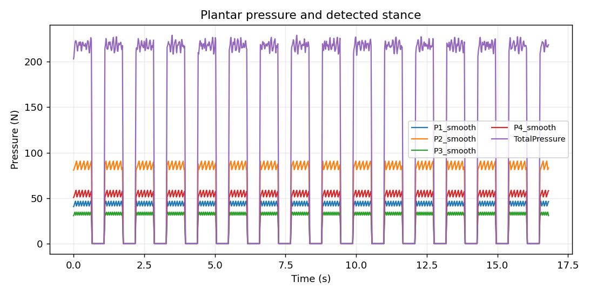

# StepWise Gait Analysis

StepWise turns pressure-insole and inertial-sensor text recordings into an explainable gait-screening report. It detects foot-contact intervals, summarizes timing and regional pressure loading, checks data quality, and exports plots and tables. It is an **engineering prototype**, not a medical device; its rules are not clinically validated and its output is not a diagnosis.



*Example generated from the repository's synthetic `synthetic_1682.txt` fixture. It contains no participant recording.*

## What is in the repository

- A typed Python analysis pipeline with one `AnalysisService` shared by the CLI, batch runner, and API.
- An asynchronous FastAPI interface with a bounded queue, supervised worker processes, hard timeouts, atomic run manifests, and allowlisted artifact downloads.
- A WeChat Mini Program client and local-only configuration placeholders; no public service is deployed.
- Synthetic fixtures, regression tests, Docker smoke coverage, and raw performance measurements.

## Try it locally

Python 3.11 or 3.12 is supported. Run these commands from the repository root.

**macOS/Linux (Bash):**

```bash
python -m venv .venv
.venv/bin/python -m pip install -e ".[dev]"
.venv/bin/python -m stepwise analyze tests/fixtures/synthetic_1682.txt --output stepwise_output/demo
```

**Windows (PowerShell):**

```powershell
python -m venv .venv
.\.venv\Scripts\python.exe -m pip install -e ".[dev]"
.\.venv\Scripts\python.exe -m stepwise analyze tests/fixtures/synthetic_1682.txt --output stepwise_output/demo
```

Open `stepwise_output/demo/user_report.html` and the generated PNG plots. The example uses synthetic data and should not be interpreted clinically.

To exercise the HTTP flow instead, start one service process. In another terminal, run the matching smoke command:

| Shell | Service | Smoke test |
|---|---|---|
| Bash | `.venv/bin/python -m uvicorn stepwise.api:create_app --factory --host 127.0.0.1 --port 8080 --workers 1` | `.venv/bin/python -m stepwise.ci_smoke --base-url http://127.0.0.1:8080 --walking tests/fixtures/minimal_walk.txt` |
| PowerShell | `.\.venv\Scripts\python.exe -m uvicorn stepwise.api:create_app --factory --host 127.0.0.1 --port 8080 --workers 1` | `.\.venv\Scripts\python.exe -m stepwise.ci_smoke --base-url http://127.0.0.1:8080 --walking tests/fixtures/minimal_walk.txt` |

This checks health, upload, status polling, result retrieval, and artifact download. OpenAPI is available at <http://127.0.0.1:8080/docs>. For the request and response contract, see [HTTP API](docs/API.md).

A local Docker build uses `docker build -t stepwise-api .` followed by `docker run --rm -p 8080:8080 stepwise-api`. The same smoke command can then target the container.

## Architecture

```text
CLI / batch ───────────────┐
                           │
FastAPI ─ bounded queue ─ spawn worker process
                           │
Mini Program ──────────────┘
                           ▼
                    AnalysisService
                           │
      parse → smooth → stance segmentation → features
                           │
          quality/conflict gates → reports and artifacts
                           │
          atomic UUID manifest + allowlisted files
```

`AnalysisService.analyze(walking_path, standing_path, output_dir, config)` is the only business entry point. Adapters do not maintain separate versions of the analysis algorithm. The API accepts a job, returns `202` with a run ID, and lets clients poll for the result. Architectural trade-offs are documented in the [decision records](docs/adr/).

## Measured engineering work

On recorded synthetic workloads, a 360,000-sample A-B-A session measured end-to-end analysis time of **21.4765 s before** and **6.6074 s after** the pipeline changes. A separate parser comparison recorded peak API-process RSS of **1.52 GB before** and **899 MB after**. With two workers and 30,000-sample jobs, measured throughput reached about **45 analyses/minute** at concurrency 10 and declined at higher concurrency. These are historical, machine-specific measurements—not production capacity or clinical-performance claims.

The [benchmark report](BENCHMARKS.md), [concurrent load-test report](LOADTEST.md), and `bench-data/` contain protocols and numeric measurements. Their recorded source commit IDs refer to the private development history and are not revisions in this public repository. Numeric values are unchanged; non-metric background process names in the published load-test dataset were normalized. Current-version behavior can be tested with the commands below.

## Limits and evidence

- The supported runtime is one Uvicorn service process using an in-memory queue and local filesystem. The API has no authentication or public deployment.
- Queue-full backpressure occurs after upload validation, so rejected work still has a cost. See [load-test findings](LOADTEST.md).
- CI and benchmarks use synthetic fixtures. No participant recordings are included.
- Screening rules and quality gates do not establish clinical accuracy.

```bash
python -m ruff check src tests
python -m mypy src/stepwise
python -m pytest --cov=stepwise --cov-report=term-missing
node --test tests/js/*.test.js
```

The repository is published for review without an open-source license.
