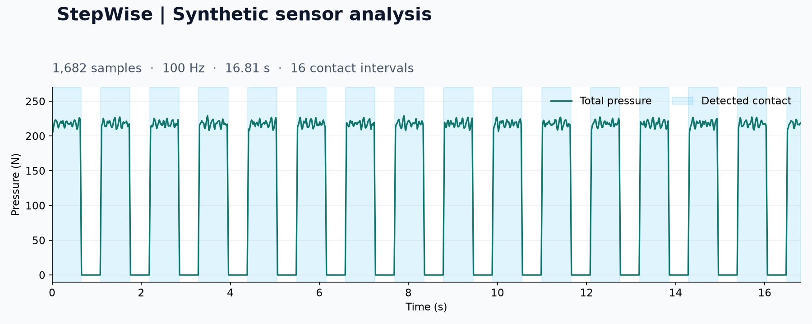
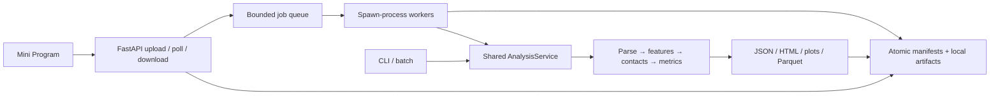

# StepWise — Asynchronous Sensor Analysis Service

[](https://github.com/npang7/stepwise-gait-analysis/actions/workflows/ci.yml)

A Python backend that turns pressure-sensor and IMU recordings into structured gait metrics, plots, and downloadable reports. A FastAPI service accepts uploads as asynchronous jobs; CLI and batch adapters reuse the same typed analysis pipeline.

**Stack:** Python · FastAPI · NumPy · pandas · PyArrow · Matplotlib · Docker · GitHub Actions

## See it run



Actual output from the [committed synthetic recording](tests/fixtures/synthetic_1682.txt): **1,682 samples**, **100 Hz**, **16.81 seconds**, and **16 detected single-foot contact intervals**. The curve and shaded intervals are generated by the analysis service, not a dashboard mockup. This is an engineering demonstration, not a clinical result or diagnostic tool.

## Engineering highlights

- **Asynchronous API:** `202 Accepted`, status polling, structured results, and allowlisted artifact downloads. A bounded queue separates request handling from CPU-heavy analysis.
- **Fault isolation:** spawn-process workers with hard timeouts; atomic job manifests; restart reconciliation; retryable terminal-state persistence and fail-closed health checks.
- **Concurrency correctness:** per-run striped locks, reader leases during downloads, and coordinated result-retention cleanup. Race and failure-path tests exercise these transitions.
- **Efficient artifacts:** Parquet-backed signals, lazy atomic CSV export, and per-series min/max plot envelopes preserve extrema without rendering every sample.
- **Quality gates:** Ruff, Mypy, Python coverage, parser-equivalence checks, Mini Program state-machine tests, dependency-bound testing, and a real non-root Docker API smoke test.

## Measured performance

| Recorded synthetic workload | Before | After |
|---|---:|---:|
| End-to-end analysis, 360,000 samples | 21.48 s | **6.61 s — ~3.25× faster** |
| Peak API process memory, 64 MiB recording | 1.52 GB | **899 MB — ~41% lower** |

The timing comparison uses an A1/B/A2 control session; memory was measured separately. These are recorded local benchmarks, not current CI timings. [Methodology, stage timings, load tests, and recomputable evidence →](docs/PERFORMANCE.md)

## Architecture


```mermaid
flowchart LR
    Client[Mini Program] --> API[FastAPI upload / poll / download]
    API --> Queue[Bounded job queue]
    Queue --> Worker[Spawn-process workers]
    Worker --> Service[Shared AnalysisService]
    CLI[CLI / batch] --> Service
    Service --> Pipeline[Parse → features → contacts → metrics]
    Pipeline --> Artifacts[JSON / HTML / plots / Parquet]
    Worker --> Store[Atomic manifests + local artifacts]
    Artifacts --> Store
    API --> Store
```

The Mini Program is a companion client. Transport adapters stay separate from analysis code, so API and offline runs share result semantics.

## Quick start

Requires **Python 3.11+**. From the repository root:

```bash
python -m venv .venv
.venv/bin/python -m pip install -e .
.venv/bin/python -m stepwise analyze tests/fixtures/synthetic_1682.txt --output stepwise_output/demo
```

<details>
<summary>Windows PowerShell</summary>

```powershell
python -m venv .venv
.\.venv\Scripts\python.exe -m pip install -e .
.\.venv\Scripts\python.exe -m stepwise analyze tests/fixtures/synthetic_1682.txt --output stepwise_output/demo
```

</details>

The command prints JSON and writes reports under `stepwise_output/demo/`. Open `user_report.html` for the readable report or `pressure_stance.png` for the signal plot.

To serve the HTTP API, activate `.venv` and run:

```bash
python -m uvicorn stepwise.api:create_app --factory --host 127.0.0.1 --port 8080
```

Interactive endpoints are available at `http://127.0.0.1:8080/docs`.

## Technical documentation

- [HTTP API](docs/API.md) — upload → poll → result → download, then error contracts.
- [Engineering guide](docs/ENGINEERING.md) — job lifecycle, runtime settings, client setup, tests, and Docker.
- [Performance evidence](docs/PERFORMANCE.md) — controlled measurements and reproducible tools.
- [Design decisions](docs/adr/README.md) — parser compatibility, lazy exports, plot envelopes, and manifest concurrency.
